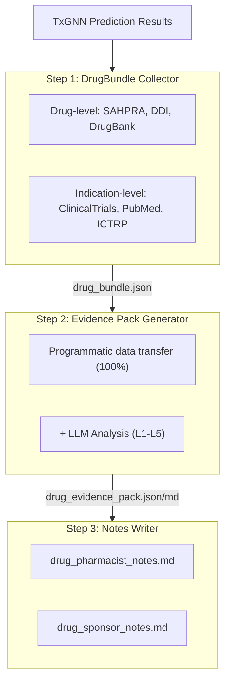
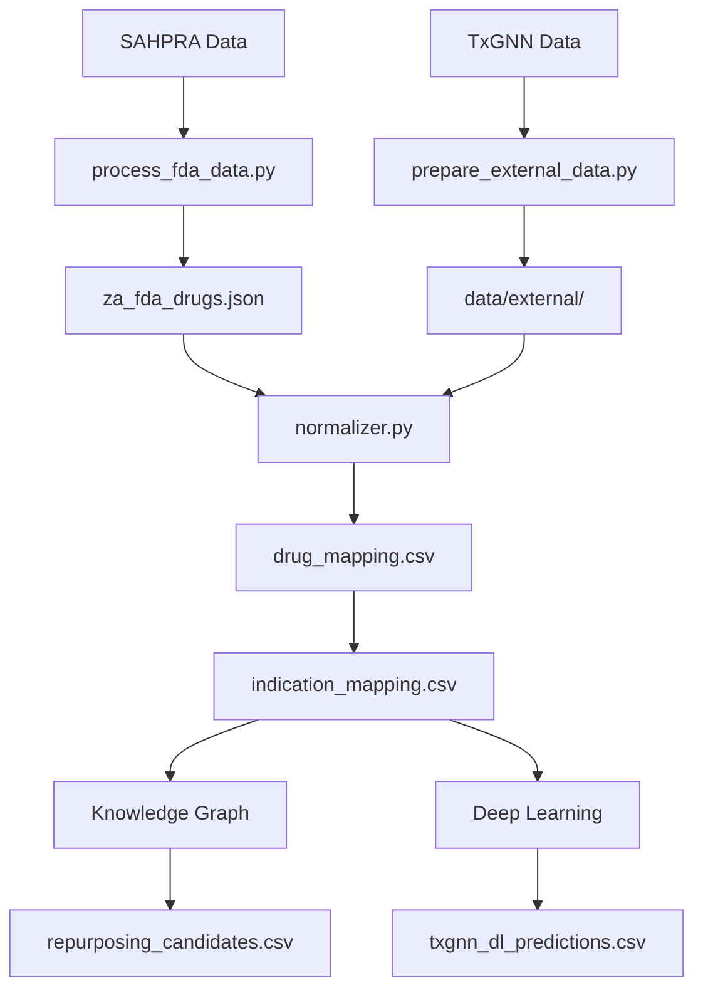

# ZaTxGNN - South Africa: Drug Repurposing

[](https://zatxgnn.yao.care)
[](https://opensource.org/licenses/MIT)

Drug repurposing predictions for South Africa SAHPRA-approved drugs using the TxGNN model.

## Disclaimer

- The results of this project are for research purposes only and do not constitute medical advice.
- Drug repurposing candidates require clinical validation before application.

## Project Overview

### Report Statistics

| Item | Count |
|------|------|
| **Drug Reports** | 455 |
| **Total Predictions** | 7,786,582 |
| **Unique Drugs** | 455 |
| **Unique Indications** | 17,081 |
| **DDI Data** | 302,516 |
| **DFI Data** | 857 |
| **DHI Data** | 35 |
| **DDSI Data** | 8,359 |
| **FHIR Resources** | 455 MK / 50,000 CUD |

### Evidence Level Distribution

| Evidence Level | Report Count | Description |
|---------|-------|------|
| **L1** | 0 | Multiple Phase 3 RCTs |
| **L2** | 0 | Single RCT or multiple Phase 2 |
| **L3** | 0 | Observational studies |
| **L4** | 0 | Preclinical / mechanistic studies |
| **L5** | 455 | Computational prediction only |

### By Source

| Source | Predictions |
|------|------|
| KG | 7,017,754 |
| KG + DL | 737,866 |
| DL | 30,962 |

### By Confidence

| Confidence | Predictions |
|------|------|
| very_high | 30,401 |
| high | 723,690 |
| medium | 7,024,859 |
| low | 7,632 |

---

## Prediction Methods

| Method | Speed | Accuracy | Requirements |
|------|------|--------|----------|
| Knowledge Graph | Fast (seconds) | Lower | No special requirements |
| Deep Learning | Slow (hours) | Higher | Conda + PyTorch + DGL |

### Knowledge Graph Method

```bash
uv run python scripts/run_kg_prediction.py
```

| Metric | Value |
|------|------|
| SAHPRA Total Drugs | 4,206 |
| Repurposing Candidates | 7,755,620 |

### Deep Learning Method

```bash
conda activate txgnn
PYTHONPATH=src python -m zatxgnn.predict.txgnn_model
```

| Metric | Value |
|------|------|
| Total DL Predictions | 741,593 |
| Unique Drugs | 455 |
| Unique Indications | 17,081 |

### Score Interpretation

The TxGNN score represents the model's confidence in a drug-disease pair, ranging from 0 to 1.

| Threshold | Meaning |
|-----|------|
| >= 0.9 | Very high confidence |
| >= 0.7 | High confidence |
| >= 0.5 | Moderate confidence |

#### Score Distribution

| Threshold | Meaning |
|-----|------|
| ≥ 0.9999 | Extremely high confidence, model's most confident predictions |
| ≥ 0.99 | Very high confidence, worth prioritizing for validation |
| ≥ 0.9 | High confidence |
| ≥ 0.5 | Moderate confidence (sigmoid decision boundary) |

#### Evidence Level Definitions

| Level | Definition | Clinical Significance |
|-----|------|---------|
| L1 | Phase 3 RCT or systematic review | Can support clinical use |
| L2 | Phase 2 RCT | Can consider for use |
| L3 | Phase 1 or observational study | Requires further evaluation |
| L4 | Case report or preclinical research | Not recommended yet |
| L5 | Computational prediction only, no clinical evidence | Requires further research |

#### Important Reminders

1. **High scores do not guarantee clinical efficacy: TxGNN scores are knowledge graph-based predictions that require clinical trial validation.**
2. **Low scores do not mean ineffective: The model may not have learned certain associations.**
3. **Recommended to use with validation pipeline: Use this project's tools to review clinical trials, literature, and other evidence.**

### Validation Pipeline



---

## Quick Start

### Step 1: Download Data

| File | Download |
|------|------|
| SAHPRA Data | Data Source |
| node.csv | [Harvard Dataverse](https://dataverse.harvard.edu/api/access/datafile/7144482) |
| kg.csv | [Harvard Dataverse](https://dataverse.harvard.edu/api/access/datafile/7144484) |
| edges.csv | [Harvard Dataverse](https://dataverse.harvard.edu/api/access/datafile/7144483) |
| model_ckpt.zip | [Google Drive](https://drive.google.com/uc?id=1fxTFkjo2jvmz9k6vesDbCeucQjGRojLj) |

### Step 2: Install Dependencies

```bash
uv sync
```

### Step 3: Process Drug Data

```bash
uv run python scripts/process_fda_data.py
```

### Step 4: Prepare Vocabulary Data

```bash
uv run python scripts/prepare_external_data.py
```

### Step 5: Run Knowledge Graph Prediction

```bash
uv run python scripts/run_kg_prediction.py
```

### Step 6: Set Up Deep Learning Environment

```bash
conda create -n txgnn python=3.11 -y
conda activate txgnn
pip install torch==2.2.2 torchvision==0.17.2
pip install dgl==1.1.3
pip install git+https://github.com/mims-harvard/TxGNN.git
pip install pandas tqdm pyyaml pydantic ogb
```

### Step 7: Run Deep Learning Prediction

```bash
conda activate txgnn
PYTHONPATH=src python -m zatxgnn.predict.txgnn_model
```

---

## Resources

### TxGNN Core

- [TxGNN Paper](https://www.nature.com/articles/s41591-024-03233-x) - Nature Medicine, 2024
- [TxGNN GitHub](https://github.com/mims-harvard/TxGNN)
- [TxGNN Explorer](http://txgnn.org)

### Data Sources

| Category | Data | Source | Note |
|------|------|------|------|
| **Drug Data** | SAHPRA | - | South Africa |
| **Knowledge Graph** | TxGNN KG | [Harvard Dataverse](https://dataverse.harvard.edu/dataset.xhtml?persistentId=doi:10.7910/DVN/IXA7BM) | 17,080 diseases, 7,957 drugs |
| **Drug Database** | DrugBank | [DrugBank](https://go.drugbank.com/) | Drug ingredient mapping |
| **Drug Interactions** | DDInter 2.0 | [DDInter](https://ddinter2.scbdd.com/) | DDI pairs |
| **Drug Interactions** | Guide to PHARMACOLOGY | [IUPHAR/BPS](https://www.guidetopharmacology.org/) | Approved drug interactions |
| **Clinical Trials** | ClinicalTrials.gov | [CT.gov API v2](https://clinicaltrials.gov/data-api/api) | Clinical trials registry |
| **Clinical Trials** | WHO ICTRP | [ICTRP API](https://apps.who.int/trialsearch/api/v1/search) | International clinical trials platform |
| **Literature** | PubMed | [NCBI E-utilities](https://eutils.ncbi.nlm.nih.gov/entrez/eutils/) | Medical literature search |
| **Name Mapping** | RxNorm | [RxNav API](https://rxnav.nlm.nih.gov/REST) | Drug name standardization bridge |
| **Name Mapping** | PubChem | [PUG-REST API](https://pubchem.ncbi.nlm.nih.gov/docs/pug-rest) | Chemical substance synonym lookup |
| **Name Mapping** | ChEMBL | [ChEMBL API](https://www.ebi.ac.uk/chembl/api/data) | Bioactivity database mapping |
| **Standards** | FHIR R4 | [HL7 FHIR](http://hl7.org/fhir/) | MedicationKnowledge, ClinicalUseDefinition |
| **Standards** | SMART on FHIR | [SMART Health IT](https://smarthealthit.org/) | EHR integration, OAuth 2.0 + PKCE |

### Model Downloads

| File | Download | Note |
|------|------|------|
| Pretrained Model | [Google Drive](https://drive.google.com/uc?id=1fxTFkjo2jvmz9k6vesDbCeucQjGRojLj) | model_ckpt.zip |
| node.csv | [Harvard Dataverse](https://dataverse.harvard.edu/api/access/datafile/7144482) | Node Data |
| kg.csv | [Harvard Dataverse](https://dataverse.harvard.edu/api/access/datafile/7144484) | Knowledge Graph Data |
| edges.csv | [Harvard Dataverse](https://dataverse.harvard.edu/api/access/datafile/7144483) | Edge Data (DL) |

## Project Introduction

### Directory Structure

```
ZaTxGNN/
├── README.md
├── CLAUDE.md
├── pyproject.toml
│
├── config/
│   └── fields.yaml
│
├── data/
│   ├── kg.csv
│   ├── node.csv
│   ├── edges.csv
│   ├── raw/
│   ├── external/
│   ├── processed/
│   │   ├── drug_mapping.csv
│   │   ├── repurposing_candidates.csv
│   │   ├── txgnn_dl_predictions.csv.gz
│   │   └── integration_stats.json
│   ├── bundles/
│   └── collected/
│
├── src/zatxgnn/
│   ├── data/
│   │   └── loader.py
│   ├── mapping/
│   │   ├── normalizer.py
│   │   ├── drugbank_mapper.py
│   │   └── disease_mapper.py
│   ├── predict/
│   │   ├── repurposing.py
│   │   └── txgnn_model.py
│   ├── collectors/
│   └── paths.py
│
├── scripts/
│   ├── process_fda_data.py
│   ├── prepare_external_data.py
│   ├── run_kg_prediction.py
│   └── integrate_predictions.py
│
├── docs/
│   ├── _drugs/
│   ├── fhir/
│   │   ├── MedicationKnowledge/
│   │   └── ClinicalUseDefinition/
│   └── smart/
│
├── model_ckpt/
└── tests/
```

**Legend**: 🔵 Project development | 🟢 Local data | 🟡 TxGNN data | 🟠 Validation pipeline

### Data Flow



---

## Citation

If you use this dataset or software, please cite:

```bibtex
@software{zatxgnn2026,
  author       = {Yao.Care},
  title        = {ZaTxGNN: Drug Repurposing Validation Reports for South Africa SAHPRA Drugs},
  year         = 2026,
  publisher    = {GitHub},
  url          = {https://github.com/yao-care/ZaTxGNN}
}
```

Also cite the original TxGNN paper:

```bibtex
@article{huang2023txgnn,
  title={A foundation model for clinician-centered drug repurposing},
  author={Huang, Kexin and Chandak, Payal and Wang, Qianwen and Haber, Shreyas and Zitnik, Marinka},
  journal={Nature Medicine},
  year={2023},
  doi={10.1038/s41591-023-02233-x}
}
```
